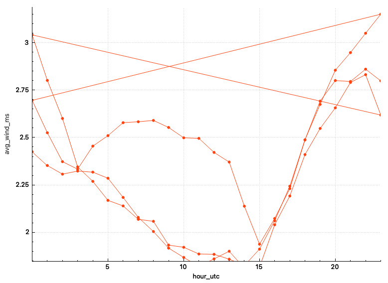
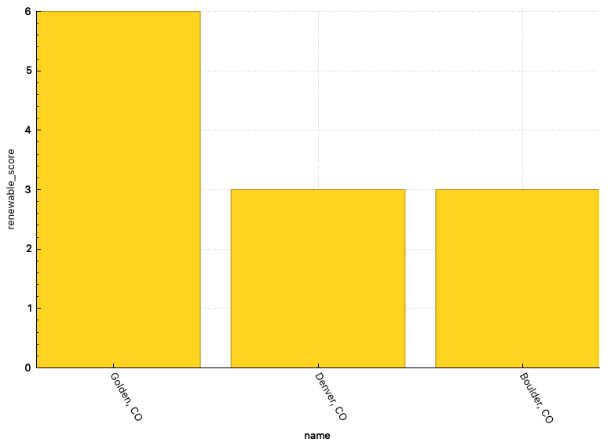

# Weather API and SQL Queries
## A small-scale project using automation, Python, SQLite and API requests

This project demonstrates a complete, small-scale data workflow for ingesting hourly weather data from the Open-Meteo API and storing it in a relational SQL database. While this example has a small sample size, this schema can be used for large scale grid datasets.

This analysis pulls temperature, wind speed, and solar radiation for several Colorado Front Range cities and performs SQL queries of resource profiles relevant to renewable energy generation and grid planning.

# Data

Variables used:
* wind_speed_10m
* shortwave_radiation

Locations Queried:
* Golden, CO
* Denver, CO
* Boulder, CO

Timeframe: 2024-01-01 to 2025-01-01

# Results

Golden, CO receives the most solar radiation and wind speed on average as well as the top solar hours compared to the other locations. The peak solar radiation hours also have higher values in Golden with Boulder having the lowest. Golden also has the highest wind speeds on average with Denver as a close second. 

When looking at wind speed across the locations, these values are much more varied. Golden has the highest wind speeds on average due to the increase during the hours of 3 and 15 while the other locations are decreasing (Figure below). Contrastingly, Denver has the highest wind speed hours of all hours.

## Combined renewable score (unit-free)

To avoid mixing units (W/m² vs m/s), the “combined renewable score” is computed using **ranks** rather than raw values:
1) Compute each location’s average solar radiation and average wind speed over the timeframe.
2) Rank locations separately by solar and wind (higher = better).
3) Sum the two ranks. A higher total indicates consistently higher solar and wind relative to the others.

This score is meant for **relative comparison across the sampled locations**, not as a physical estimate of energy output.

